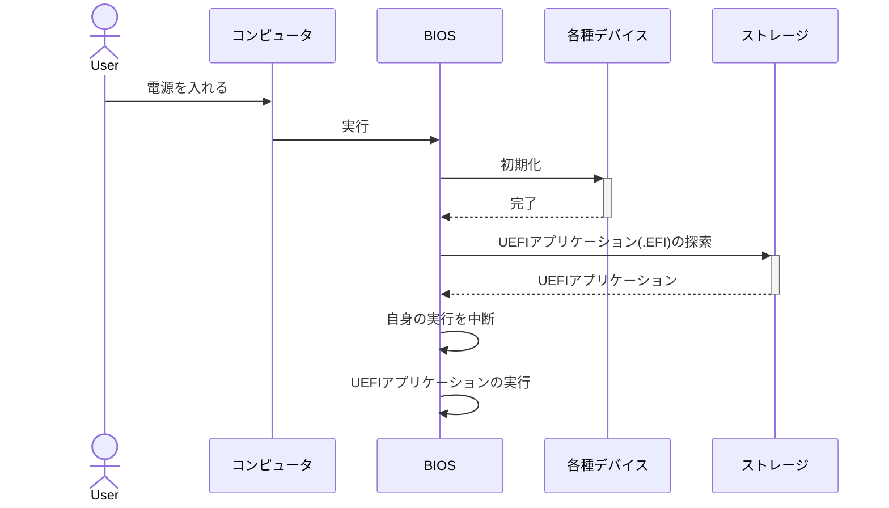

こんにちは、**kaiware**です。

みかん本Day1その2。

[前回の記事](https://zenn.dev/kaiware0x/articles/mikan-osbook-day1)が長くなってしまったので続きを書いていく。

## 出現した用語の調査

### 「#!/bin/bash」とは

ShellScriptの1行目に `#!/bin/bash` と書かれていることがあるが、これは `/bin/bash` がスクリプトを実行することを表している。
この行のことを **シェバン(shebang, シバン)** と呼ぶ。

### ループバックデバイス

`mount`コマンドの`-o loop`は**ループバックデバイス**を指定するオプション。
ループバックデバイスとはLinuxの仮想デバイスの一種。
普通のファイル（例：disk.img）をブロックデバイス（ハードディスクのような扱い）としてマウントするための仕組み。

概念図：

### 文字コード

コンピュータは数字しか扱えないので、文字も内部では数値データとして扱っている。
**その数値と文字の対応関係を文字コードと呼ぶ**。

有名どころ：

- ASCII
- Unicode
- Shift-JIS

`BOOTX64.EFI`ファイルでは、Unicodeの一種である **UCS-2** を使っている。
UCS-2は1文字を2Byte(16bit)で表す。例えば、`H`は`0x0048`で表す。
ただし、Byte単位で表す場合は`0x48 0x00`の並びになる。
これは**x86-64アーキテクチャがリトルエンディアンを採用している**ためである。

### リトルエンディアンとビッグエンディアン

多Byteの数値を並べる方法として、リトルエンディアンとビッグエンディアンがある。

**リトルエンディアン**は下位のByteから順番に並べていく方式である。
先程の`H`の例で示すと、UCS-2自体は`H`に対応するコードは`0x0048`だが、1Byteずつ並べると`0x48 0x00`になる。

**ビッグエンディアン**は上位のByteから順番に並べていく方式である。
`H`を1Byteずつ並べると`0x00 0x48`になる。

### OVMFとは

**OVMF（Open Virtual Machine Firmware）** は、**UEFIファームウェアのオープンソース実装**。
簡単に言えば、**仮想マシンでUEFI環境を提供するためのファームウェア**。
UEFIブートを伴う自作OSや仮想マシン環境を作るなら、**OVMFは必須のツール**。

#### 🔍 用語の整理

| 用語     | 意味                                                                    |
| -------- | ----------------------------------------------------------------------- |
| **BIOS** | 従来のブートファームウェア（レガシー）                                  |
| **UEFI** | BIOSの後継。より柔軟・安全なブート機構                                  |
| **OVMF** | QEMUなどの仮想環境で使うUEFIファームウェア（=UEFIの仮想マシン向け実装） |

#### 📦 OVMFの中身

OVMFは以下の2つのファイルで構成される：

| ファイル名     | 内容                                                            |
| -------------- | --------------------------------------------------------------- |
| `OVMF_CODE.fd` | UEFIファームウェア本体（読み取り専用）                          |
| `OVMF_VARS.fd` | UEFI変数（ブート順・時刻など）を保持するNVRAM領域（書き込み可） |

#### ⚙ OVMFの役割

仮想マシンにおいて、以下のような役割を果たす：

* **UEFI準拠のブート**：GPTディスクから起動可能（MBRでなくてもOK）
* **セキュアブート対応**（一部構成では）
* **自作OSのUEFIブート開発や検証**に使われる
* **QEMUやKVM上でWindows/LinuxのUEFIブートテスト**が可能

#### 💡 どこで使われている？

* QEMU / KVM
* libvirt や virt-manager
* 自作OS開発環境

#### ✅ まとめ

| 項目     | 内容                                                  |
| -------- | ----------------------------------------------------- |
| 名称     | OVMF（Open Virtual Machine Firmware）                 |
| 正体     | UEFIの仮想マシン用オープンソースファームウェア        |
| 主な用途 | QEMUなどでUEFI環境を提供する                          |
| 主な構成 | `OVMF_CODE.fd`（コード）＋ `OVMF_VARS.fd`（変数領域） |

#### 🔧 OVMF\_CODE.fd の提供元

**EDK II（UEFI開発キット）の一部として、Tianocore プロジェクトが提供している。**

* **EDK II（UEFI Development Kit II）** は、UEFI Forum（Intel主導）によるオープンソースのUEFIファームウェア実装。
    * その中の「QEMUターゲット」向けビルド成果物が **OVMF（Open Virtual Machine Firmware）**。
* **Tianocore** は EDK II の公式オープンソース開発プロジェクトであり、GitHub にコードが公開されている。

📎 [Tianocore GitHub](https://github.com/tianocore/tianocore.github.io)

📦 Linuxディストリビューション（Ubuntu, Fedoraなど）では、パッケージとして以下のような名前で提供される：

* Debian / Ubuntu: `ovmf`
* Fedora / RHEL: `edk2-ovmf`
* Arch: `edk2-ovmf`

#### 💻 通常のPC（実機）ではOVMFは使われない

物理PCのUEFIファームウェアは：

* **各PCメーカー（例：ASUS, Dell, Lenovo, HP）** が独自にビルド・提供
* EDK IIをベースにしていることもあるが、**独自のセキュリティ拡張や設定画面**が加えられており、OVMFとは異なる
* したがって、`OVMF_CODE.fd` をそのままPCにインストールして使うことは**できない**

#### 🤖 OVMFの位置づけ

| 項目         | 内容                                                             |
| ------------ | ---------------------------------------------------------------- |
| 提供元       | Tianocore / EDK II プロジェクト                                  |
| 配布形態     | QEMU/KVM用の UEFI バイナリ（Linuxディストリでも配布）            |
| 対象         | **仮想マシン**でUEFI動作を再現したい開発者・研究者               |
| 実機との違い | 実機ではベンダー製のUEFIファームウェアが使われる（OVMFは非対象） |

#### ✅ まとめ

* `OVMF_CODE.fd` は **Tianocore（EDK II）** が提供する仮想マシン向けのUEFIファームウェア。
* **QEMUやKVMなどの仮想マシン上でUEFIブートを可能にするためのもの**。
* **通常のPC起動時には使われない**（実機はベンダー製UEFIファームウェアを使用）。

## OS起動までの流れ

下記の**UEFIアプリケーション**がOS(ブートローダ)などに対応する。

## BIOS

- **Basic Input Output System**
- コンピュータの電源を入れて最初に実行されるプログラム。
- ファームウェアと呼ばれる。
- OS起動前にコンピュータ内部を初期化する。
- OS(ブートローダ)をストレージから読み出す。

### UEFI

- **Unified Extensible Firmware Interface**
- BIOSの新しい仕様。
- UEFIに従って作られたBIOSを **UEFI BIOS** と呼ぶ。

## EFIファイル生成までの流れ

### PE形式

- PE: **Portable Executable**
- Windowsでの実行可能ファイルの標準形式
- EFIファイルでも一般的に採用されている
- COFF形式のオブジェクトファイルをリンクして生成する(ことが一般的)

### ELF形式

- ELF: **Executable and Linkable Format**
    - 実行可能かつリンク可能フォーマット
- Linuxでの実行可能ファイルの標準形式
- ELFファイルはオブジェクトファイルの形式としても使える

## 次回

https://zenn.dev/kaiware0x/articles/mikan-osbook-day2
