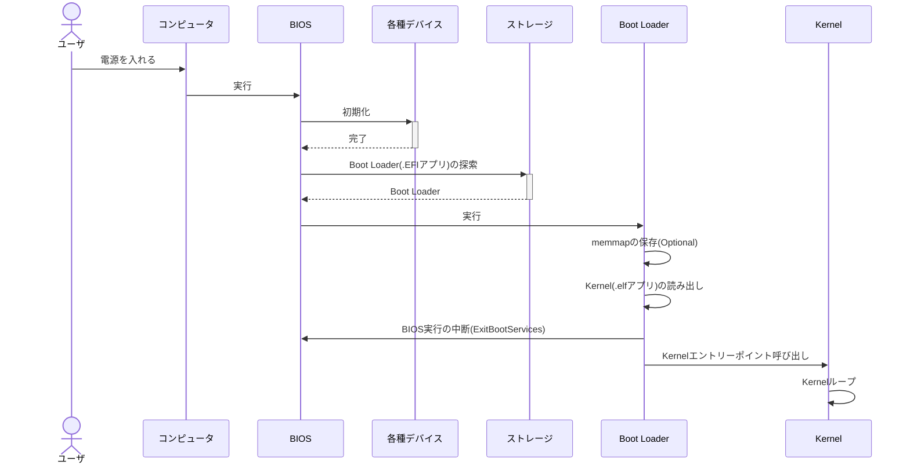

こんにちは、**kaiware**です。

みかん本Day3(第3章)について、各種用語や詰まった箇所のメモを残す。

前回はこちら。
https://zenn.dev/kaiware0x/articles/mikan-osbook-day2


# レジスタ Register

レジスタとは、**値を登録しておく記憶領域**。CPUの内部にある。

QEMUで起動中端末のレジスタ値を確認できる：

```bash
(qemu) info registers
RAX=0000000000000000 RBX=0000000000000001 RCX=000000003fb7b1c0 RDX=0000000000000031
RSI=0000000000000400 RDI=000000003fea92a0 RBP=000000000000002e RSP=000000003fea8870
R8 =0000000000000000 R9 =000000003fecc30f R10=0000000000000050 R11=0000000000000000
R12=000000003e67d73e R13=000000003fea8900 R14=000000003fea88b8 R15=000000003f21b920
RIP=000000003e67c411 RFL=00000202 [-------] CPL=0 II=0 A20=1 SMM=0 HLT=0
以下略
```

## 汎用レジスタ

- RAX~R15までの16個
- 各64bit(8Byte)

次の図のように、64bit未満の値を格納するための名前(EAX,AXなど)も用意されている。


## 特殊レジスタ

以下に例を挙げるが、他にもある。

- RIP
    - IP: Instruction Pointer
    - デバッグ時によく使う
    - 次に実行される予定の機械語命令の位置を示している
    - メモリダンプと組み合わせると、現在実行中の機械語命令を確認できる
- RFLAGS
    - 命令の実行結果によって変化するフラグを集めたレジスタ
    - 明示的に値を変更しなくても、別の命令を実行するとRFLAGSも自動で書き換わる
    - bit 0: キャリーフラグ CF
        - 加算結果がオーバーフローするとCFが1になる
    - bit 6: ゼロフラグ ZF
        - 命令の実行結果がゼロならZFが1になる
- CR0
    - CPUの重要な設定を集めたレジスタ
    - bit 0: PE。1ならCPUは保護モードになる
    - bit 31: PG。1ならページングが有効になる

# メモリダンプ

メモリダンプとは、**メモリの中身をそのまま丸ごと表示・保存したもの**。
QEMUの`x`コマンドでメモリダンプを行える。
以下は`RIP`レジスタ付近のメモリダンプ。

```bash
# 4個分、16進数で、1Byteずつ、RIPアドレスからダンプ
(qemu) x /4xb 0x3e67c411
000000003e67c411: 0xeb 0xfe 0x48 0x83
```

**xコマンドの構文**：

```bash
x /[N][F][B] ADDRESS
```

**各パラメータの意味**：

| パラメータ | 意味                                                             |
| ---------- | ---------------------------------------------------------------- |
| `N`        | 表示する個数（省略時は1）                                        |
| `F`        | 表示形式（例：`x`=16進, `d`=10進, `i`=命令）                     |
| `B`        | 単位サイズ（`b`=1バイト, `h`=2バイト, `w`=4バイト, `g`=8バイト） |
| `ADDRESS`  | アドレス（例：`0x7fffd000`, `$rsp`, `0x1000 + 8` など）          |


パラメータに`/2i`を指定すると、バイナリ命令を逆アセンブルしてアセンブリコードを表示できる。

```bash
(qemu) x /2i 0x3e67c411
0x000000003e67c411:  jmp    0x3e67c411
0x000000003e67c413:  sub    $0x28,%rsp
```

上記`jmp    0x3e67c411`命令は自分自身のアドレスにJumpしている。
つまり、ソースコードの`while(1);`に対応するアセンブリである。

# アセンブリ

raxレジスタへrbxレジスタの値を加算する例：

```asm
add rax, rbx
```

C++では次のようなイメージ。

```cpp
rax += rbx;
```

C/C++ソースコードで、`__asm__()`を使うとアセンブリ命令を埋め込める。
これを **インラインアセンブラ** と呼ぶ。

例：

```cpp
extern "C" void KernelMain() {
    while(1) __asm__("hlt");
}
```

`__asm__("hlt")`はCPUを停止させて省電力状態にするための命令。
割り込みがあれば動作が再開する。

# カーネル

**Day3のタグへチェックアウト**：

```
cd $HOME/workspace/mikanos
git checkout osbook_day03a
cd kernel
```

### **コンパイル**

オブジェクトファイル`main.o`が出力される。

```sh
clang++ -O2 -Wall -g --target=x86_64-elf -ffreestanding -mno-red-zone \
-fno-exceptions -fno-rtti -std=c++17 -c main.cpp
```

**各引数の説明**：

| 引数                  | 一言説明                                                             |
| --------------------- | -------------------------------------------------------------------- |
| `clang++`             | C++用Clangコンパイラを呼び出す                                       |
| `-O2`                 | 最適化レベル2（標準的な最適化）                                      |
| `-Wall`               | すべての警告を表示                                                   |
| `-g`                  | デバッグ情報を埋め込む                                               |
| `--target=x86_64-elf` | 出力対象をx86\_64向けELF形式にする（クロスコンパイル用）             |
| `-ffreestanding`      | 標準ライブラリに依存しないOSの上で動かないプログラム（OS開発用など） |
| `-mno-red-zone`       | スタックの「レッドゾーン」を使わない（割り込み安全）                 |
| `-fno-exceptions`     | 例外機能を無効化                                                     |
| `-fno-rtti`           | RTTI（実行時型情報）を無効化                                         |
| `-std=c++17`          | C++17標準でコンパイル                                                |
| `-c`                  | リンクせず、オブジェクトファイル（.o）を生成                         |
| `main.cpp`            | ソースファイルの指定                                                 |

- red-zone: スタックポインタを少し超えた領域

### **リンク**：

```bash
ld.lld --entry KernelMain -z norelro --image-base 0x100000 --static \
-o kernel.elf main.o
```

**各引数の説明**：

| 引数                    | 一言説明                                           |
| ----------------------- | -------------------------------------------------- |
| `ld.lld`                | LLVM版のリンカを呼び出す                           |
| `--entry KernelMain`    | プログラムの開始関数を `KernelMain` に指定         |
| `-z norelro`            | RELRO（メモリ保護機構）を無効にする                |
| `--image-base 0x100000` | 実行ファイルのベースアドレスを `0x100000` に設定   |
| `--static`              | すべて静的リンクで行う（共有ライブラリを使わない） |
| `-o kernel.elf`         | 出力ファイル名を `kernel.elf` に指定               |
| `main.o`                | 入力オブジェクトファイル                           |


```log
$ readelf -h kernel.elf
ELF Header:
  Magic:   7f 45 4c 46 02 01 01 00 00 00 00 00 00 00 00 00
  Class:                             ELF64
  Data:                              2's complement, little endian
  Version:                           1 (current)
  OS/ABI:                            UNIX - System V
  ABI Version:                       0
  Type:                              EXEC (Executable file)
  Machine:                           Advanced Micro Devices X86-64
  Version:                           0x1
  Entry point address:               0x101120
  Start of program headers:          64 (bytes into file)
  Start of section headers:          1056 (bytes into file)
  Flags:                             0x0
  Size of this header:               64 (bytes)
  Size of program headers:           56 (bytes)
  Number of program headers:         4
  Size of section headers:           64 (bytes)
  Number of section headers:         14
  Section header string table index: 12
```

# ブートローダーのビルド

```sh
cd $HOME/edk2
ln -s $HOME/workspace/mikanos/MikanLoaderPkg ./ # シンボリックリンクを張る
source edksetup.sh # ターミナル起動時のみ。環境変数がセットされる
build
# Output: $HOME/edk2/Build/MikanLoaderX64/DEBUG_CLANG38/X64/Loader.efi
```

# 実行 (osbook_day03a)

```sh
cd ~/edk2
~/osbook/devenv/run_qemu.sh ./Build/MikanLoaderX64/DEBUG_CLANG38/X64/Loader.efi ~/
workspace/mikanos/kernel/kernel.elf
```


### **レジスタの状態を確認**：

```log
(qemu) info registers
RAX=000000003fb7b3e0 RBX=000000003fb79f3b RCX=000000003fb7b3e0 RDX=000000003fea03f8
RSI=0000000000000000 RDI=000000000080201a RBP=000000003fea87e0 RSP=000000003fea83c0
R8 =0000000000000001 R9 =0000000000000000 R10=0000000000000000 R11=0000000000000000
R12=000000003f308198 R13=0000000000000210 R14=000000003fb68234 R15=0000000000000006
RIP=000000003fb73016 RFL=00000046 [---Z-P-] CPL=0 II=0 A20=1 SMM=0 HLT=0
ES =0030 0000000000000000 ffffffff 00cf9300 DPL=0 DS   [-WA]
CS =0038 0000000000000000 ffffffff 00af9a00 DPL=0 CS64 [-R-]
SS =0030 0000000000000000 ffffffff 00cf9300 DPL=0 DS   [-WA]
DS =0030 0000000000000000 ffffffff 00cf9300 DPL=0 DS   [-WA]
FS =0030 0000000000000000 ffffffff 00cf9300 DPL=0 DS   [-WA]
GS =0030 0000000000000000 ffffffff 00cf9300 DPL=0 DS   [-WA]
LDT=0000 0000000000000000 0000ffff 00008200 DPL=0 LDT
TR =0000 0000000000000000 0000ffff 00008b00 DPL=0 TSS64-busy
GDT=     000000003fbee698 00000047
IDT=     000000003f306018 00000fff
CR0=80010033 CR2=0000000000000000 CR3=000000003fc01000 CR4=00000668
DR0=0000000000000000 DR1=0000000000000000 DR2=0000000000000000 DR3=0000000000000000
DR6=00000000ffff0ff0 DR7=0000000000000400
EFER=0000000000000500
FCW=037f FSW=0000 [ST=0] FTW=00 MXCSR=00001f80
FPR0=0000000000000000 0000 FPR1=0000000000000000 0000
FPR2=0000000000000000 0000 FPR3=0000000000000000 0000
FPR4=0000000000000000 0000 FPR5=0000000000000000 0000
FPR6=0000000000000000 0000 FPR7=0000000000000000 0000
XMM00=0000000000000000 0000000000000000 XMM01=0000000000000000 0000000000000000
XMM02=0000000000000000 0000000000000000 XMM03=0000000000000000 0000000000000000
XMM04=0000000000000000 0000000000000000 XMM05=0000000000000000 0000000000000000
XMM06=0000000000000000 0000000000000000 XMM07=0000000000000000 0000000000000000
XMM08=0000000000000000 0000000000000000 XMM09=0000000000000000 0000000000000000
XMM10=0000000000000000 0000000000000000 XMM11=0000000000000000 0000000000000000
XMM12=0000000000000000 0000000000000000 XMM13=0000000000000000 0000000000000000
XMM14=0000000000000000 0000000000000000 XMM15=0000000000000000 0000000000000000
```

`RIP=000000003fb73016`をメモ。

### **メインメモリの内容を確認**：

```log
(qemu) x /2i 0x3fb73016
0x000000003fb73016:  cmpq   $0x0,0x40(%rsp)
0x000000003fb7301c:  je     0x3fb73016
```

みかん本と出力内容が異なる。
こちらはlldのバージョンが新しいことによる誤動作とのこと。

https://github.com/uchan-nos/os-from-zero/issues/134

章を進めていき **ELFローダ** を実装すれば解決するとのことなので、一旦放置。

### 実行時フローの再確認



# 実行 (osbook_day03c)

**Kernelの再ビルド**：

```sh
clang++ $CPPFLAGS -I/usr/include/c++/11 -I/usr/include/x86_64-linux-gnu/c++/11 -I/usr/include/x86_64-linux-gnu -O2 -Wall -g --target=x86_64-elf -ffreestanding -mno-red-zone -fno-exceptions -c main.cpp

ld.lld $LDFLAGS --entry KernelMain -z norelro --image-base 0x100000 --static -o kernel.elf main.o
```

実行したが、みかん本にあるような模様が出てこない。
これもlldのバージョンが原因と思われ、章を進めれば解決するはずなので一旦このまま進める。


# 次回

https://zenn.dev/kaiware0x/articles/mikan-osbook-day3
